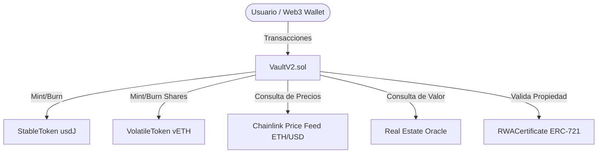

# Technical Requirements Document (TRD): Dyad Vault V2

* **Versión:** 1.0
* **Fecha:** 2026-06-26
* **Roles Responsables:** [agency-software-architect](file:///C:/Users/Jose/.gemini/config/skills/agency-software-architect/SKILL.md) & [agency-solidity-smart-contract-engineer](file:///C:/Users/Jose/.gemini/config/skills/agency-solidity-smart-contract-engineer/SKILL.md)
* **Estado:** Propuesto para Implementación

---

## 1. Arquitectura del Sistema

El sistema se compone de un frontend en Next.js 16 que interactúa con el contrato principal [VaultV2.sol](file:///c:/Users/Jose/Documents/UniswapV4/dyad-vault/contracts/VaultV2.sol). Este contrato gestiona dos tokens ERC-20 (`usdJ` y `vETH`) y se integra con dos oráculos y un contrato ERC-721 ([RWACertificate.sol](file:///c:/Users/Jose/Documents/UniswapV4/dyad-vault/contracts/RWACertificate.sol)).



---

## 2. Especificación de Contratos e Interfaces

### 2.1 Errores Personalizados (Custom Errors)
Para optimizar el gas en despliegues y fallos de ejecución, se eliminan los strings de los `require` y se implementan los siguientes errores:

```solidity
error DepositoInvalido();
error SaldoInsuficiente();
error LiquidezInsuficiente();
error PrecioInvalido();
error FeedInvalido();
error FeedObsoleto();
error LimiteLTVExcedido();
error NoEsDuenoDelCertificado();
error DeslizamientoExcedido();
error DivisionPorCero();
```

### 2.2 Eventos (Event Emission)
Cada cambio de estado crítico debe emitir un evento para permitir la indexación en el frontend:

```solidity
event Deposited(address indexed user, uint256 ethAmount, uint256 stableMinted, uint256 volatileSharesMinted);
event RedeemedStable(address indexed user, uint256 stableAmount, uint256 ethReturned);
event RedeemedVolatile(address indexed user, uint256 volatileShares, uint256 ethReturned);
event RwaMinted(address indexed user, uint256 indexed propertyId, uint256 netAmount, uint256 fee);
```

---

## 3. Lógica Matemática e Invariantes del Protocolo

### 3.1 Modelo de Bóveda de Excedente (Surplus Share - Modelo ERC4626)
Para resolver la vulnerabilidad crítica de acuñación infinita de `vETH` sin respaldo real, los tokens `vETH` dejarán de acuñarse en relación 1:1 con el ETH depositado. En su lugar, funcionarán como **participaciones de un pool de excedente** (modelo similar a ERC-4626).

#### Definiciones:
*   $B_{ETH}$: Balance total de ETH en el contrato (`address(this).balance`).
*   $S_{usdJ}$: Suministro total de `usdJ` en circulación (`stableToken.totalSupply()`).
*   $P_{ETH}$: Precio actual de ETH en USD (con 18 decimales).
*   $E_{Locked}$: ETH bloqueado para respaldar las monedas estables.
    $$E_{Locked} = \frac{S_{usdJ} \times 1e18}{P_{ETH}}$$
*   $A_{Surplus}$: Activos netos excedentes del pool (colateral real libre).
    $$A_{Surplus} = B_{ETH} - E_{Locked}$$
*   $T_{vETH}$: Suministro total de tokens de participación `vETH` en circulación.

#### Algoritmo de Acuñación de Acciones (vETH Shares):
Cuando un usuario realiza un depósito de $ETH_{dep}$, se calcula la porción de excedente que no respalda la deuda estable ($ETH_{surplus}$). Con un LTV configurado a $LTV_{max}$ (ej. 75%):
$$ETH_{stable\_backing} = ETH_{dep} \times LTV_{max}$$
$$ETH_{surplus} = ETH_{dep} - ETH_{stable\_backing} = ETH_{dep} \times (1 - LTV_{max})$$

*   Si $T_{vETH} == 0$, las acciones a acuñar son:
    $$Shares_{minted} = ETH_{surplus}$$
*   Si $T_{vETH} > 0$, las acciones a acuñar son:
    $$Shares_{minted} = \frac{ETH_{surplus} \times T_{vETH}}{A_{Surplus\_before\_dep}}$$

#### Algoritmo de Redención de Acciones (vETH Shares):
Cuando un usuario retira mediante `redeemVolatile(shares)`:
$$ETH_{return} = \frac{A_{Surplus} \times shares}{T_{vETH}}$$

---

## 4. Firmas de Funciones y Lógica de Implementación

### 4.1 Función: `deposit()`
Permite depositar ETH, acuñar `usdJ` bajo el límite LTV del 75%, y acuñar participaciones `vETH` basadas en el excedente de colateral aportado.

```solidity
function deposit() external payable nonReentrant {
    if (msg.value == 0) revert DepositoInvalido();
    
    uint256 currentPrice = getLatestPrice();
    uint256 ltvPercentage = 75; // 75% LTV Máximo
    
    // 1. Calcular usdJ a acuñar (75% del valor depositado)
    uint256 stableAmountToMint = (msg.value * currentPrice * ltvPercentage) / (1e18 * 100);
    
    // 2. Calcular el excedente aportado al pool (25% restante)
    uint256 ethSurplus = (msg.value * (100 - ltvPercentage)) / 100;
    
    // 3. Calcular vETH shares a acuñar (Modelo ERC4626)
    uint256 totalVolatileSupply = volatileToken.totalSupply();
    uint256 totalStableSupply = stableToken.totalSupply();
    uint256 sharesToMint;
    
    if (totalVolatileSupply == 0) {
        sharesToMint = ethSurplus;
    } else {
        uint256 ethLockedForStables = (totalStableSupply * 1e18) / currentPrice;
        // Balance del contrato antes de registrar este depósito de ETH
        uint256 balanceBefore = address(this).balance - msg.value;
        uint256 surplusAssets = balanceBefore > ethLockedForStables ? balanceBefore - ethLockedForStables : 0;
        
        if (surplusAssets == 0) {
            sharesToMint = ethSurplus;
        } else {
            sharesToMint = (ethSurplus * totalVolatileSupply) / surplusAssets;
        }
    }
    
    // 4. Efectos e Interacciones
    stableToken.mint(msg.sender, stableAmountToMint);
    volatileToken.mint(msg.sender, sharesToMint);
    
    emit Deposited(msg.sender, msg.value, stableAmountToMint, sharesToMint);
}
```

### 4.2 Función: `redeemStable()`
Quema `usdJ` y devuelve el colateral en ETH correspondiente al valor nominal en dólares, con protección de deslizamiento de precios.

```solidity
function redeemStable(uint256 stableAmount, uint256 minEthExpected) external nonReentrant {
    if (stableToken.balanceOf(msg.sender) < stableAmount) revert SaldoInsuficiente();
    
    uint256 currentPrice = getLatestPrice();
    uint256 ethToReturn = (stableAmount * 1e18) / currentPrice;
    
    if (ethToReturn < minEthExpected) revert DeslizamientoExcedido();
    if (address(this).balance < ethToReturn) revert LiquidezInsuficiente();
    
    // Efecto
    stableToken.burn(msg.sender, stableAmount);
    
    // Interacción (Transferencia de ETH segura)
    (bool success, ) = payable(msg.sender).call{value: ethToReturn}("");
    if (!success) revert LiquidezInsuficiente();
    
    emit RedeemedStable(msg.sender, stableAmount, ethToReturn);
}
```

### 4.3 Función: `redeemVolatile()`
Quema las acciones `vETH` del excedente del pool y devuelve la porción correspondiente de ETH libre.

```solidity
function redeemVolatile(uint256 volatileAmount, uint256 minEthExpected) external nonReentrant {
    if (volatileToken.balanceOf(msg.sender) < volatileAmount) revert SaldoInsuficiente();
    
    uint256 currentPrice = getLatestPrice();
    uint256 totalStableSupply = stableToken.totalSupply();
    uint256 totalVolatileSupply = volatileToken.totalSupply();
    
    if (totalVolatileSupply == 0) revert DivisionPorCero();
    
    uint256 ethLockedForStables = (totalStableSupply * 1e18) / currentPrice;
    uint256 surplusAssets = address(this).balance > ethLockedForStables ? address(this).balance - ethLockedForStables : 0;
    
    uint256 ethToReturn = (surplusAssets * volatileAmount) / totalVolatileSupply;
    
    if (ethToReturn < minEthExpected) revert DeslizamientoExcedido();
    if (address(this).balance < ethToReturn) revert LiquidezInsuficiente();
    
    // Efecto
    volatileToken.burn(msg.sender, volatileAmount);
    
    // Interacción
    if (ethToReturn > 0) {
        (bool success, ) = payable(msg.sender).call{value: ethToReturn}("");
        if (!success) revert LiquidezInsuficiente();
    }
    
    emit RedeemedVolatile(msg.sender, volatileAmount, ethToReturn);
}
```

---

## 5. Estrategia de Mitigación de Vulnerabilidades

1.  **Protección contra Reentradas:** Uso estricto del modificador `nonReentrant` de OpenZeppelin en todos los métodos de redención y retiro.
2.  **Validación de Oráculo de Precios (Staleness Check):** 
    *   ETH Price Feed: Revertir si el precio reportado por Chainlink es $\le 0$ o si han transcurrido más de 3600 segundos (1 hora) desde la última actualización.
    *   Real Estate Oracle: Revertir si los datos de precio inmobiliario tienen más de 7 días.
3.  **Seguridad Aritmética:** Uso nativo de validaciones matemáticas seguras para prevenir desbordamientos o pérdidas de precisión en divisiones (multiplicar primero, dividir después).
